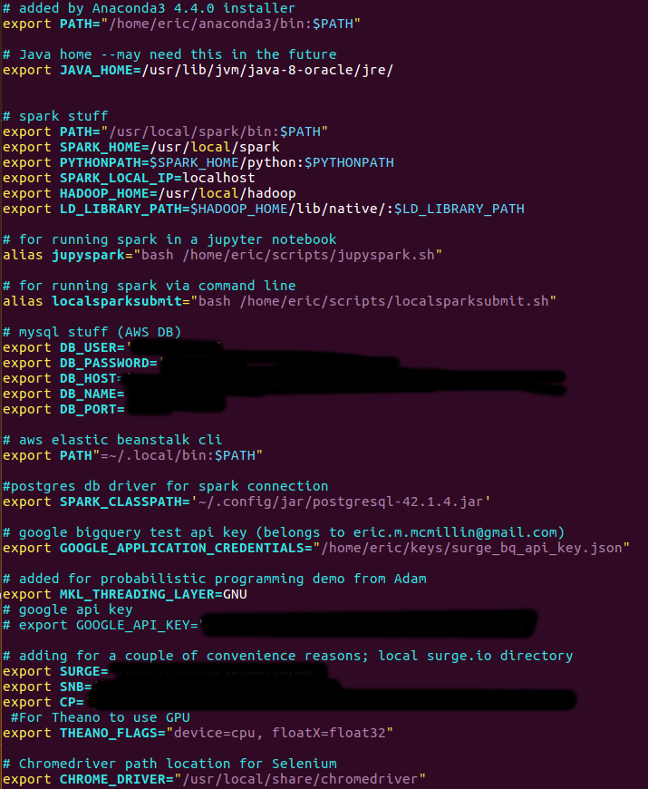
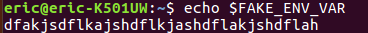
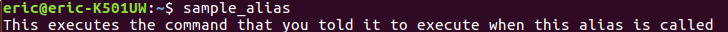
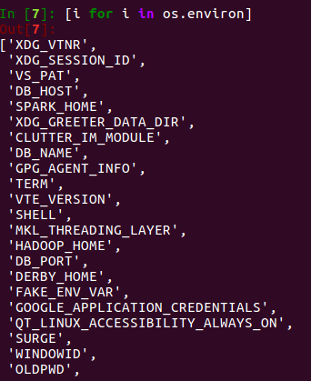

# Using Environment Variables to Hide Api Keys...
##### *...or enable laziness*

## Intro:
After a certain amount of time you'll find that you may have an absurd amount of API keys, and may want to find a better way to organize them. You definitely don't want to store them on Github (or any public location) because that would allow anybody to copy your fingerprint and do anything they want with your privileges. There are a number of ways that you can organize keys and other values that you want to be able to reference easily, but to serve as a quick example of one, I like to use environment variables (using config or rc files).

### What is an environment variable?
To anchor an example, think about how we have used conda install <whatever> or jupyter notebook.. both conda and jupyter are named environment variables that, when used in a terminal environment, your computer references a config file to see how to use it. More generally, an environment variable is just something that you want your computer to know or something that you want to hide behind the scenes.

### Where should my config file be?
*This may be different for Windows...*

Most of the time, your computer will already have some .bashrc/ .profile/ .config/ etc file hidden in your home directory. If you do not, you can create and source one yourself.

* My config location:
  * Pretty much all of the .<files> are configuration files. The file I use for bash variables is .bashrc

* Config contents:
  * This file contains a bunch of "exports", these exports tells bash the value of the named variable. This value can be any number of things: string, bash command, number, url, file paths, etc.

* Each export follows the following structure:
  * export < name > = < value >
  * such that when you reference variable, bash interprets it as its value
    * if export: you will need to reference the variable using a $ prefix
    * if alias: the value can be referenced with just the name

* To create new environment variable

Outer: create file, edit (using vim), source contents (exports/ aliases contents to bash environment)

Inner: create exports/ aliases

### Using these variables:

* In bash (terminal)

Export:

Alias:
* Behind the scenes I wrote a shell script called fake_script.sh (same as referenced in alias statement).
  * This script prints the string below the call

* In python

* To see available keys:

