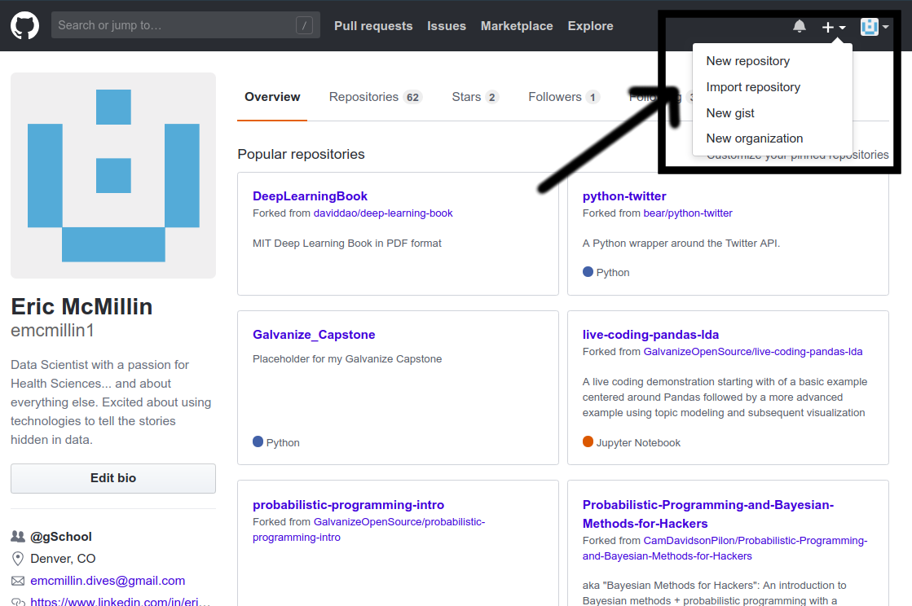
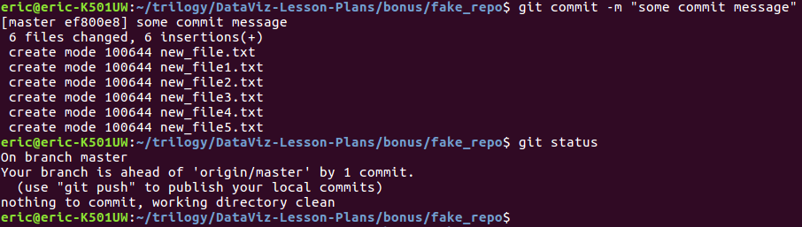
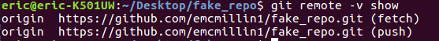

# Github Demo:

Over this demo I want to provide a simple, quick, repeatable work flow for working with Git/ Github. Note that this will not the only way to come to the same result, and will not go into a whole lot of depth. For a more inclusive demo, there are a variety of on-line courses/ materials available on-line.

## High Level Workflow:
1. Create new Repository on Github
2. Clone Repository to Local Directory
3. Make Changes to Directory
4. Git Add Files (Stage Changes)
5. Git Commit
6. Git Push
7. Git Pull
* Repeat steps 3-7

## Steps:

### Create Repository:

* To get the repo to initialize, git needs something to track. So, create a readme or other file (numerous options on how to do this.. just read the github prompts).

### Clone Repo to Local

* Copy Github endpoint (url)

* Navigate to wherever you want the directory to be built, run $ git clone <url>

### Do Stuff

* Do Stuff

### Stage Changes

* Check git status if you want to see what changes have been made

* $ git add

#### (Optional: Do more stuff, add to stages)

* Just Showing that I did more stuff

* Batch add using -A option

### Commit

### Push

#### Hypotheticals:

* Change repo endpoint
  * You would have to do this if:
    * You started the repo locally, and wanted to push to GitHub
    * You accidentally delete your .git directory.
    * You're bored and looking for extra work

* Below figure shows all of the steps to initialize empty (local) repo, check endpoint, set desired endpoint, and pull

* Each Line:
  * rm-rf .git : removes existing git directory
  * ls -a : illustrates that i no longer have .git repo
  * git init : initializes a new .git directory
    * This is not the same .git directory as the one we previously removed and will not have the same endpoint
  * git remote -v show : this shows the current configured endpoint for push/ pull operations
    * Nothing prints out because there is no endpoint set.
  * git remote add origin <url> : configures local .git directory to push / pull endpoint
  * git pull : with this new endpoint configured git pull now references the set remote, and pulls down contents of github endpoint

* To illustrate the new endpoint:

